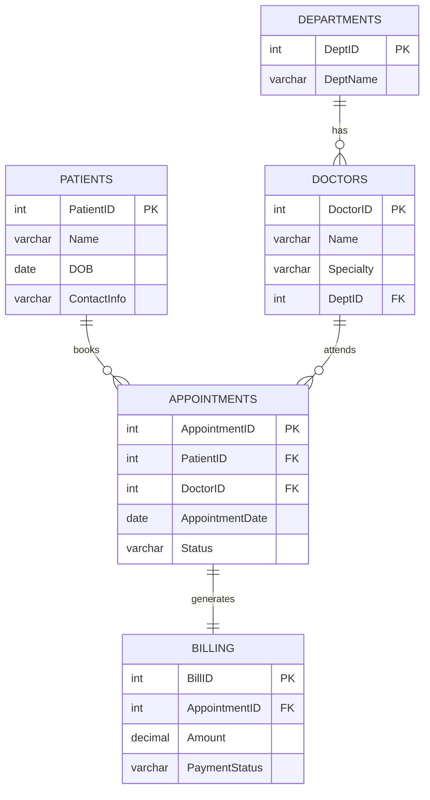

# Hospital Management System ER Diagram

## Relationship Summary
- One department has many doctors.
- One patient can have many appointments.
- One doctor can attend many appointments.
- Each appointment generates one billing record.
- Each billing record belongs to exactly one appointment.
